# Coinbase market data transformations

dbt project for transforming the Snowflake ingestion table containing Coinbase market snapshots from Azure Blob JSON files. The ingestion layer remains owned by the existing Snowflake task; this project starts at the raw table and publishes governed transformation and serving models.

## Layout

| Layer | Models | Materialization |
|---|---|---|
| `STAGING` | `stg_coinbase__market_snapshots` | View; safe JSON-to-typed-column parsing, source lineage |
| `INTERMEDIATE` | reserved for reusable business logic | View |
| `CORE` | `market_ticks` | Dynamic table; deduplicated canonical tick grain |
| `MARTS` | hourly spread stats, forecast accuracy, feed health | Dynamic tables |
| `SERVE` | consumer-facing hourly market and forecast views | Views |

See [the architecture and operating notes](docs/architecture-and-governance.md), including decisions where the original diagram needed more precision.

## Transformation data flow

```mermaid
flowchart LR
    Azure["Azure Blob Storage<br/>Compressed JSON files"] --> Stage["Snowflake external stage"]
    Stage --> Load["Scheduled task<br/>COPY INTO"]
    Load --> Raw[("RAW_STREAM<br/>RAW_DATA: VARIANT<br/>FILENAME, LOADED_AT")]

    subgraph DBT["dbt transformation and serving layers"]
        Raw --> Stg["STAGING · View<br/>stg_coinbase__market_snapshots<br/>Typed fields + source lineage"]
        Stg --> Ticks["CORE · Dynamic Table<br/>market_ticks<br/>Canonical deduplicated ticks"]
        Ticks --> Spread["MARTS · Dynamic Table<br/>spread_stats_hourly"]
        Ticks --> Forecast["MARTS · Dynamic Table<br/>forecast_accuracy"]
        Ticks --> Health["MARTS · Dynamic Table<br/>feed_health_log"]
        Spread --> MarketServe["SERVE · View<br/>market_quality_hourly"]
        Health --> MarketServe
        Forecast --> ForecastServe["SERVE · View<br/>forecast_performance_hourly"]
    end

    MarketServe --> Consumers["Dashboard and<br/>analytics consumers"]
    ForecastServe --> Consumers

    classDef azure fill:#e6f2ff,stroke:#0078d4,color:#102a43,stroke-width:2px;
    classDef ingest fill:#eef2f6,stroke:#52616b,color:#17212b,stroke-width:1.5px;
    classDef raw fill:#fff3d6,stroke:#b7791f,color:#4a2c00,stroke-width:2px;
    classDef staging fill:#e8f5ef,stroke:#26856a,color:#123d32,stroke-width:1.5px;
    classDef core fill:#dff4f5,stroke:#087f8c,color:#123d42,stroke-width:2px;
    classDef marts fill:#fff8d9,stroke:#a47b00,color:#4d3b00,stroke-width:1.5px;
    classDef serve fill:#fbe9e7,stroke:#b84a3a,color:#4a201a,stroke-width:1.5px;
    classDef consumer fill:#f2ecf7,stroke:#72558a,color:#30233a,stroke-width:1.5px;

    class Azure azure;
    class Stage,Load ingest;
    class Raw raw;
    class Stg staging;
    class Ticks core;
    class Spread,Forecast,Health marts;
    class MarketServe,ForecastServe serve;
    class Consumers consumer;

    style DBT fill:#fafbfc,stroke:#9aa5b1,stroke-width:1px;
```

The same dbt graph is built into separate Snowflake databases for `dev`, `ci`, and `prod`; only the target schema naming and credentials differ by environment.

## Environments

Every target writes to a separate database:

| Target | Database | Schema layout | Writer |
|---|---|---|---|
| `dev` | `COINBASEPOC_DEV` | `DBT_<DEVELOPER>_<LAYER>` | Developer, using local `dbt build` |
| `ci` | `COINBASEPOC_CI` | `PR_<NUMBER>_<LAYER>` | GitHub Actions on pull requests |
| `prod` | `COINBASEPOC_PROD` | `<LAYER>` | GitHub Actions after merge to `master` |

`profiles/profiles.template.yml` is committed; the real `profiles/profiles.yml` is generated locally and ignored. All credentials are environment variables; use Snowflake key-pair authentication.

### Local development

1. Create and activate the virtual environment: `python3 -m venv .venv && source .venv/bin/activate` (Windows PowerShell: `.venv\\Scripts\\Activate.ps1`).
2. Install the pinned dbt packages: `python -m pip install -r requirements.txt`.
3. Copy `profiles/profiles.template.yml` to `profiles/profiles.yml`.
4. Set `SNOWFLAKE_ACCOUNT`, `SNOWFLAKE_USER`, and `SNOWFLAKE_PRIVATE_KEY_PATH`. For this setup, use `SNOWFLAKE_ROLE_DEV=ROLE_COINBASEPOC_DEV_PBARAZESH`, `SNOWFLAKE_DATABASE_DEV=COINBASEPOC_DEV`, `SNOWFLAKE_WAREHOUSE_DEV=WH_COINBASEPOC_DEV`, and `SNOWFLAKE_SCHEMA_DEV=DBT_PBARAZESH` (replace the developer suffix if yours differs). The role and schema are separate settings: the per-developer role controls permissions; `DBT_<DEVELOPER_ID>` determines isolated dbt schema names.
5. Set `COINBASE_RAW_DATABASE`, `COINBASE_RAW_SCHEMA`, and `COINBASE_RAW_TABLE` if the ingestion object differs from the documented default `COINBASEPOC.INGEST.RAW_STREAM`.
6. Run `dbt debug --target dev --profiles-dir profiles`, then `dbt build --target dev --profiles-dir profiles`.

## GitHub setup

Add repository secrets `SNOWFLAKE_ACCOUNT`, `SNOWFLAKE_USER`, `SNOWFLAKE_PRIVATE_KEY`, `SNOWFLAKE_ROLE_CI`, and `SNOWFLAKE_WAREHOUSE_CI`. Configure the matching production user/key plus `SNOWFLAKE_ROLE_PROD` and `SNOWFLAKE_WAREHOUSE_PROD` as secrets in a protected `production` environment. Add raw object name overrides as repository variables if needed, and require the `dbt-ci / ci` check in branch protection for `master`.

The PR workflow builds and tests in a pull-request-specific schema. The trusted `pull_request_target` cleanup workflow checks out `master` and drops only its validated `PR_<number>` schemas. The production workflow runs from the merged `master` commit. CI and prod use separate Snowflake users/roles or distinct role grants, and credentials must not be available to untrusted fork pull requests.

Snowflake account roles and grants are provisioned separately by an administrator with `snowflake/admin/provision_environments.sql`; ordinary dbt workflows do not receive role-management privileges. The script is rerunnable after replacing its placeholders.

### dbt Docs on GitHub Pages

In the repository's **Settings > Pages**, set the deployment source to **GitHub Actions**. Allow GitHub Actions to deploy to the automatically managed `github-pages` environment; no additional Snowflake or Pages secrets are required.

After a successful same-repository PR build, `dbt-docs-pages` publishes that PR's docs under `/pr/<number>/` and lists it at `/previews/`. Closing the PR removes its preview. A successful production build after merge replaces the docs at the site root while preserving open previews.

For this repository, the default Pages endpoints are:

- Production: <https://parhambrz.github.io/coinbasepoc-transformation/>
- Open PR previews: <https://parhambrz.github.io/coinbasepoc-transformation/previews/>
- Individual preview: `https://parhambrz.github.io/coinbasepoc-transformation/pr/<number>/`

The publisher stores the assembled site on the `gh-pages` branch and deploys it through GitHub Pages. PR code never receives the publisher's write token: only the trusted workflow on `master` downloads successful CI artifacts, and fork PR artifacts are not published.

## Working with AI

### What you delegated to an agent and what you wrote or rewrote yourself?

- Inital dbt model, test, github actions workflows, Snowflake provisioning queries, architecture documentation and dbt docs scaffolding were delegated to the agent (Gemini and Claude models). Consumer dashboard was delegated to the agent (Coco)
- Reviewing of the proposed layers, data flow, implementation process, clarifying the data contracts and snapshot grain, GA workflow and target system setup and validations, via iterative revisions and requesting for the upgrade/fix of missing capabilities or plan deviations done by me. Azure setup of data ingestion layer was done manually. some dev tools for schema validation were written by agent with manual revisions.

### One thing the agent got wrong, or subtly wrong, and how you caught it?

- The initial architecture claimed it treated Snowlake file load idempotency for end to end no data loss guarantee. After tracing the full path it was known COPY INTO cannot detect WebSocket events before blob storage (due to start/stop of the ingestion process). So the claim was narrowed down to deduplication of ingested records.
- The initial GA workflow was implemented incorrectly and incompletely. An unnecessary dbt deps was used and failed. No external packages are used in the dbt setup. So a cleanup was needed to be done. CI/CD Workflows need manual setup and the validation was manually done. dbt docs were not generated and published. After review and cleanup of the workflows, organized doc are hosted on Github pages with multiple channels for production env and single PRs. This was detected by checking the workflow logs. Local tools like act can help with manual debug.
- The agentic plan implemented incorrect permission for the BI_READER role including lack of specific priviledges to the required dynamic tables. It was fixed after human review over the target system (roles and permission checks)
- The agentic solution implemented an unnecessary intermediate layer. This was decided to be left for potential future developments.

### Where you would not let an agent work unsupervised on this code, and why?

- I require human review for the jobs done by admin level roles and grants, credentials and production deployment. The reason is mistakes can expose data or interrupt/damage critical infrastructure.
- I require human validation of the design and implementation steps, e.g. source contracts and financial metrics. Since reasonable looking code can still encode incorrect operational or business assumptions.